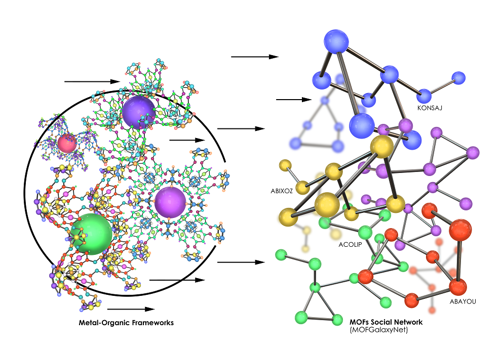
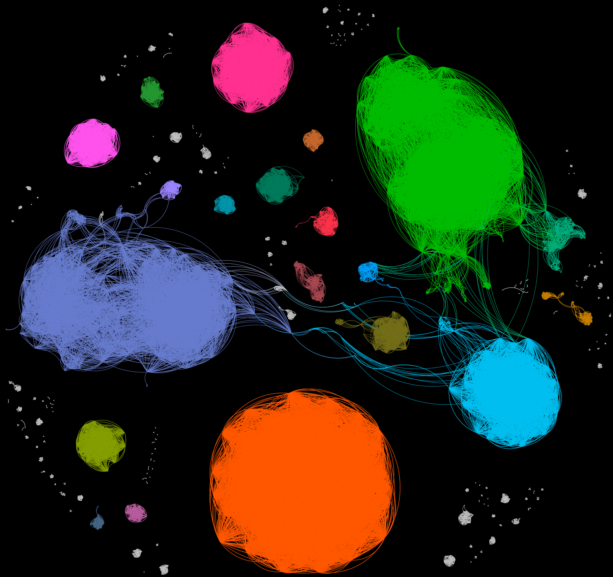

# MOFGalaxyNet
MOFGalaxyNet is a novel tool proposed in the work to overcome the challenge of understanding specific properties of Metal-Organic Frameworks (MOFs) and predict guest accessibility. MOFs are porous structures composed of metal ions and organic entities, known for their diverse applications. However, their properties are often understood post-manufacture or through theoretical models, making targeted development challenging. For example, determining the precise pore limiting diameter (PLD) and guest accessibility is not straightforward based solely on the metal ion and organic ligand. This knowledge gap hampers industrial adoption. 

To address this limitation, the study introduces MOFGalaxyNet, a tool that predicts guest accessibility using only information about the organic linkers and metal ions in the MOFs. MOFGalaxyNet leverages a galaxy-like MOF social network and a Graphical Convolutional Network (GCN). The network represents MOFs as nodes and captures relationships between them. The GCN analyzes the social network and predicts the guest accessibility of new MOF entries. This approach offers a general screening method for studying host-guest interactions in MOFs.

## Figures

  
   
  <em>Figure 1: Transforming the metal-organic framework into a social network named as MOFGalaxyNet‎.</em>

  
   
  <em>Figure 2: Depicts MOFGalaxyNet as a galaxy of MOF ‎‎.</em>

## Citation

If you find MOFGalaxyNet useful in your research, please consider citing our paper:

Jalali, Mehrdad, AD Dinga Wonanke, and Christof Wöll. "MOFGalaxyNet: a social network analysis for predicting guest accessibility in metal–organic frameworks utilizing graph convolutional networks." *Journal of Cheminformatics* 15.1 (2023): 94.

[Link to the paper](https://link.springer.com/article/10.1186/s13321-023-00764-2)

